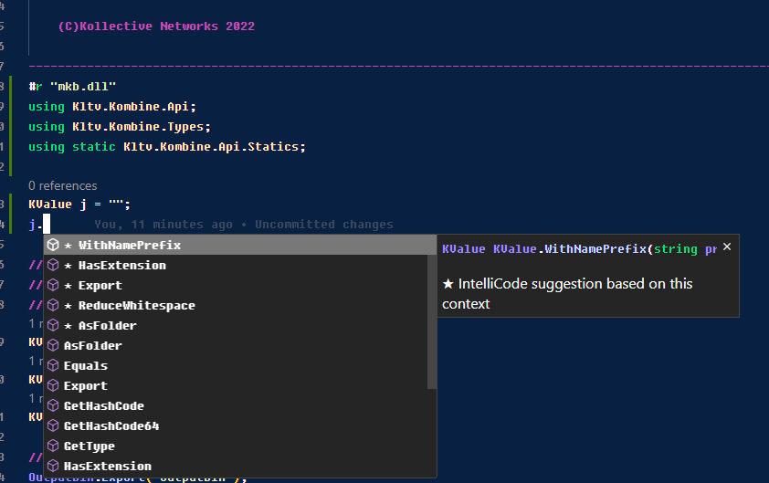
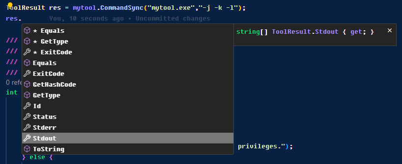

# Kombine Build System

#### [Overview](#overview)
#### [Features](#features)
#### [Feature state](doc/features.md)
#### [Download and Installation](#download-and-installation)
#### [Usage](#usage)
#### [Script structure and execution](#script-structure-and-execution)
#### [Executing child scripts](#executing-child-scripts-and-sharing-values-between-your-scripts)
#### [Simple example](#the-most-simple-example-execute-a-tool-and-fetch-the-results)
#### [Extending Kombine](#extending-kombine)
#### [Requirements to create Kombine](doc/reasons.md)
#### [Building the Kombine tool](doc/building.md)
#### [API reference](doc/api.md)
#### [TODO List](doc/todo.md)
#### [License](#license)

## Overview

There are a ton of different building systems but we had some specific requirements that doesn't fit with the current ones. Don't get us wrong. The real problem behind is we wanted some bits from each tool. If you want to have fun, just read [this](https://www.reddit.com/r/cpp/comments/i7825h/build_system_whats_your_favorite/).

For a complete list of the requirements and the underlying reasons to create a new build tool, [check this](doc/reasons.md).

Kombine is just a plain / simple build system. It is based on the [Roslyn Compiler](https://github.com/dotnet/roslyn) and created in C#, so, in fact, the language you use to create the build scripts is C#. Easy syntax, self explanatory and portable across platforms.
It is single file / self contained so you don't need dotnet to execute it. Kombine will load and execute your build scripts without any other requirement. You don't know C#? Don't be afraid, we kept as simple as possible so it is not required to be a C# master to define a script. Check [Usage](#usage) to start digging into the build scripts.

## Features

- Works on Windows, Linux and Mac OSX
- Implements an easy way to pass and receive parameters in your build script(s)
- Launches any tool (commands can be queued, launched in paralel)
- Receives the tool result in a way you can do whatever you wan't (the entire stdout/stderr and codes)
- Being C# you can use all the string manipulation facilities or regular expressions or anything required to parse text files, results and more.
- Has functions to deal with folders cross platform (create/delete/copy)
- Has functions to deal with files cross platform (exists, create, write, delete)
- Has two builtin types (KValue / KList) for values or list of values, so, you can use simpler syntax to maintain a list of arguments for a tool.
- Has consistent information about the host environemnt so you don't need to write custom code for each platform just to know if you're running under root, for example.
- Has http download facility, avoiding then install a third party tool or use a different one depending on the host os.
- Has console output (including colors for warnings and errors), indentation and even an integrated progress bar.
- Has the capability to share your variables to your child process environement or scripts.
- Has the capability to share your objects (for example a file opened) to your child scripts.
- Has the capability to register in your build variables that should be consulted by the rest of the scripts.
- Has file globbing facilities, so, you don't need to specify every single file in your build
- Has the capability to launch child scripts without requiring create another process.

## Download and Installation

You have all the files in the [releases](https://github.com/kollective-networks/kltv.kombine/releases/tag/preview) page. 

Just grab the file for your platform ( [Windows](https://github.com/kollective-networks/kltv.kombine/releases/download/preview/kombine.win.zip), [Linux](https://github.com/kollective-networks/kltv.kombine/releases/download/preview/kombine.lnx.tar.gz) or [Mac OSX](https://github.com/kollective-networks/kltv.kombine/releases/download/preview/kombine.osx.tar.gz) ) a place it on the path. Nothing else.

That's all. No other dependencies. No other languages. You're done. That's the way we [wanted](doc/reasons.md).

If you plan to use intellisense to edit your scripts maybe you need the reference assembly to be used as input for intellisense.
You can take it from [here](https://github.com/kollective-networks/kltv.kombine/releases/download/preview/kombine.ref.zip). In that case refer to your IDE about requirements to support the language (C#) and how to activate / use the intellisense.

If you plan to debug your build scripts (yes, they can be debugged) you may require a dotnet debugger. Refer to your IDE/environement about requirements to support debug the language (C#) and how to use it. Since there is a bug in the dotnet debugger(s) that may impact you (regarding to debug a single file executable) we provide the unpacked versions as well so, if required, you can grab them here for [Windows](https://github.com/kollective-networks/kltv.kombine/releases/download/preview/kombine.debug.win.zip), [Linux](https://github.com/kollective-networks/kltv.kombine/releases/download/preview/kombine.debug.lnx.tar.gz) and [Mac OSX](https://github.com/kollective-networks/kltv.kombine/releases/download/preview/kombine.debug.osx.tar.gz)

Anyway, If you use [Visual Studio Code](https://code.visualstudio.com), take a look into the .vscode folder in the project since you can check it there about the launch/debug configurations for C#.

## Usage

The usage is pretty simple:

```mkb [parameters] [action] [action parameters]```

The tool is case sensitive. This is the output if you just execute "mkb". "mkb" stands for Make Kombine Build

```
[parameters] They are optional and can be any of the following:

-ksdbg
   Script will include debug information so script debugging will be possible.
-ksrb or -ksrebuild
   Script will be rebuilt and cache will be skipped.
-ko:silent or -ko:s
   Script output will be silent.
-ko:normal or -ko:n
   Script output will be normal.
-ko:verbose or -ko:v
   Script output will be verbose.
-ko:debug or -ko:d
   Script output will be debug.
-kfile:filename
   Indicates which script file we should execute (default kombine.csx)

[action] Action to be executed. If not specified the default action is "khelp"
         The action is used to specify which function in the script should be called after evaluation but
         there are some reserved actions for the tool itself which cannot be used for the scripts:

 kversion: Shows tool version and exit.
 khelp: Show this help and exit.
 kconfig: Manages the tool configuration.
 kcache: Manages the tool cache.

[action parameters]
         They are optional and belongs to the specified action. In case of scripts,they are passed to the
         executed function as parameters. For example: mkb kcache help
```

The parameters are intended for the tool itself. It regulates if the script will include debug information (required to debug the script if you need to took that way), control the output and indicate which script the tool should execute (the default is "kombine.csx" in your current folder)

The script output is more intended to debug the script (without attach a debugger) since in verbose or debug it will drop in the console information lines about what is being processed (inner messages from the tool itself) so, for example, if you use a "Glob" and you want to check what the "Glob" detected, just place the output as debug and you will see the log lines.

The common is:<br>
	- Normal will output only your messages in your script.<br>
	- Verbose will output like normal but also information from the functions you call.<br>
	- Debug as verbose but also debug information from the tool itself.<br>

Action is the function that will be executed in your script, check out on [Script Structure](#script-structure-and-execution)
Anyway there are other actions that are reserved for the tool itself and they're builtin the tool like kconfig and kcache.
Check further about cache and config operations.

Action parameters will be sent to the Action you execute it. Everything behind an action is consider as an action parameter.

## Script structure and execution

The script has two different parts. The global and the actions.
Let's put one example:

```
KValue mymessage = "hello world!";

int build(string[] args){
	Msg.Print("I'm building: "+mymessage);
	return 0;
}
int clean(string[] args){
	Msg.Print("I'm cleaning: "+mymessage);
	return 0;
}
```

The first part is the global code. It will be executed always. You can place there whatever you want. You can define values, lists or call functions.
For example, if you add on the global code a line with Http.DownloadFile("youruri","pathtosave"); the file will be downloaded in all the script executions.

The second part (the functions) are the actions. If you call this script as "mkb build" the global code will be executed but next, the function "build" will be executed. Function will receive the action parameters in the string array and the return code will indicate the exiting code from the script execution.

Quite easy right? We tried to fetch the simplicity from make but making it cross platform out of the box.
From an action function being called, you can do whatever you want as well (create instances, call other functions, whatever, remember, is C#).

But wait, this should be slow, right?
Well, if fact, it is, for the first execution of the script. Invoke Roslyn and compile a piece of C# code (with maybe other includes) is not a fast task. 
Oh, okey, it is not the end of the world, when we said "is not fast" is because it could take a pair of seconds, it will not consume you half life. 

Anyway, that's why we added a build cache which is transparent to you. If its the first time the script is executed or if you modify the script, it will be built again and place on the cache (which is on your home folder but in the space reserved for applications, for example, in windows /users/"username"/appdata/roaming/kombine). In the following executions the script will run as an application, without being built or anything else, so, it's fast.

If you want to rebuild your script then you may use a parameter or an action.

If you invoke as action "mkb kcache clear" everything on the build cache will be deleted, so, the next script executions will rebuild the scripts again.
If you invoke as argument "mkb -ksrb youraction yourargs" the cache for the current script will be ignored, it will be rebuild again.

The cache is intended to have its own garbage collection system, so, in any Kombine execution files no longer needed will be dropped from the cache itself. Anyway this is not implemented yet.

We tried also to make it the simpler as posible, for example, to define a list:
```
KList	src = "my item1";
		src += "my item2"
```
or
```
KList	src = new() { "item1", "item2" };
```
And you can remove as well like:
```
KList	src = new() { "item1", "item2" };
        src -= "item2";
```
This is particular useful for example when you deal with command line parameters and you need to add/remove them.

The KValue and KList types has nicer conversions and useful methods (For example, KList has a "Flatten" method which actually converts the list into a single KValue, very nice to pass the list of parameters to a tool).

Don't forget to check out for the [API details](doc/api.md) or the [Examples](#examples) to learn more about what is available.

### Enable intellisense in your editor

If your environment allows some form of "intellisense" (like Visual Studio Code) the most standard way is the following, but think that this depends on your environment. Maybe you need to place the reference assembly in an specific location or others. Refer to your environment documentation for intellisense options.

The regular way is just add in your script a #r "mkb.dll" directive to the reference assembly of the tool. Grab the reference assembly from [here](https://github.com/kollective-networks/kltv.kombine/releases/download/preview/kombine.ref.zip) and put it alongside your script. Optionally add in your script the usings required for the intellisense to work.

The usings with the reference for the intellisense could be something like:

```
#r "mkb.dll"
using Kltv.Kombine.Api;
using Kltv.Kombine.Types;
using static Kltv.Kombine.Api.Statics;
using static Kltv.Kombine.Api.Tool;
```



Remember, this is not required to execute the script. Even more, kombine will ignore that code. It is only to enable the intellisense to help you write the scripts.

There are no more rules. Rest is up to you. No constrainst, anything.
Check the [API provided by the tool](doc/api.md) to get more information about builtin functionality.

Download the reference assembly to be used for intellisense [here](https://github.com/kollective-networks/kltv.kombine/releases/download/preview/kombine.ref.zip)

## Debugging your scripts

It is possible to debug your scripts. With just for example, using VSCode and the dotnet debugger. You only need to set your launch.json to execute the tool with the script with the appropiate parameters, set a breakpoint in your script code and that's all. Of course, never forget to pass the -ksdbg flag in this case to generate debug information on the script :)

One example of launch.json for Visual Studio Code could be this one:
```
{
	// Use IntelliSense to learn about possible attributes.
	// Hover to view descriptions of existing attributes.
	// For more information, visit: https://go.microsoft.com/fwlink/?linkid=830387
	"version": "0.2.0",
	"configurations": [
		{
			"name": "C#: Debug script",
			"type": "coreclr",
			"request": "launch",
			"windows": {
				"program": "mkb.exe"
			},
			"linux":{
				"program": "mkb.out"
			},
			"osx": {
				"program": "mkb.out"
			},
			"args": [ "-ksdbg","-ko:d", "youractionhere","yourparameters" ],
			"cwd": "folder for your script",
			"console": "integratedTerminal",
		}
	]
}
```

As a side note: In some cases the dotnet debugger [fails to execute](https://github.com/dotnet/runtime/issues/42927) and attach a single file dotnet binary. If that's the case, and you want to debug your scripts, grab a copy of the self contained tool but not in single file and use it. 
The dotnet failure is reported for [different frameworks](https://github.com/dotnet/runtime/issues/84428) was suposed to be [fixed for dotnet 8](https://github.com/dotnet/runtime/pull/84965) but in fact, it is not.

The self contained but not single file can be downloaded from here:<br>
[Windows](https://github.com/kollective-networks/kltv.kombine/releases/download/preview/kombine.debug.win.zip)<br>
[Linux](https://github.com/kollective-networks/kltv.kombine/releases/download/preview/kombine.debug.lnx.tar.gz)<br>
[Mac OSX](https://github.com/kollective-networks/kltv.kombine/releases/download/preview/kombine.debug.osx.tar.gz)<br>

## Executing child scripts and sharing values between your scripts

Kombine has a function called "Kombine" with the following prototype:

```public static int Kombine(string script,string action, string[]? args = null,bool changedir = true,bool search = true)```

This function is used to invoke another kombine script. The script string is the filename and may contain absolute or relative paths.
Also you need to specify the action and optionally arguments to the action. The "changedir" parameter is to instruct if we want to switch the current working directory to the directory where the script is. 

The "search" parameter is used to indicate if we want automatic search for the Kombine scripts. The order is the same as when we include another script by including (see [Extending Kombine](#extending-kombine)).

The order is the following:<br>
-The current working directory<br>
-The current script directory<br>
-Forward paths<br>
-Backward paths<br>
-Kombine tool directory<br> 

The function will return the exitcode as result of the child script execution. Quite simple right?

But maybe you need to share information between your parent and your child scripts (maybe some global definitions, paths or whatever).
There are multiple methods:

### Using Import/Export

The first method is using the KValue methods "Import" and "Export". 
Export will take the content of the variable and set it on the internal environment table. It takes the name as it should be exported.
```
KValue myvar = "value";
myvar.Export("VAR");
```
The content of "myvar", that is "value" will be available for:<br>
- Child scripts if they use the Import method.<br>
- Child processes launched by Exec or Tool if they take that environment variable called "VAR".<br>

It is posible then to setup environment variables for all the running child proceses.

Import will do the oposite but it is a bit different.
```
KValue myvar = KValue.Import("VAR","othervalue");
```
In this case, myvar will be filled out with the value of the environment variable "VAR" or with "othervalue" as default value if the environment variable does not exists.This is specially useful if you want to have scripts that may run standalone but accept parameters from parent scripts to modify the behavior.

### Using Shared API

Sometimes share a value is not enough and you want to share a more complex thing. 
Think for example in one real life case, the "compile_commands.json" for the clang intellisense. 
Ideally you want your parent/master script to define where the compile_commands should be stored and next execute the diferent parts of your build, but each one adding / modifying the appropiate values in that specific "compile_commands".

For that purpose you have:
Share.Set and Share.Get to store and retrieve objects. Following the past case you can create a class to manage the file and pass the instance to the rest of the scripts. This approach is taken in the provided as example "clang.csx" class to share the compile commands with all the descendant scripts.

Share.Set takes name for the shared resource and object as parameter and Share.Get takes the name of the shared resource to be retrieved.
This is how is used in the clang.csx to manage that file but can be applied to whatever you want. 
```
		if (Share.Get("compile_commands") != null) {
			compdb = Share.Get("compile_commands") as JsonFile;
			return true;
		}else{
			// Create it if not exists
			compdb = new JsonFile(file);
			if (compdb.Doc == null) {
				// Is a new one, just create the array.
				compdb.Doc = new JsonArray();
				if (compdb.Save() == true){
					Share.Set("compile_commands",compdb);
					return true;
				}
				Msg.PrintWarning("Failed to create a new compile commands file: "+file,Msg.LogLevels.Verbose);
				return false;
			}
			Share.Set("compile_commands",compdb);
			return true;
		}
```
Remember, Shared API exports to child scripts but not for parent ones or brothers exactly the same as Import/Export.

### Using Registry API

Sometimes you need to propagate in a different way. Until now we saw the we can share things with the scripts executed as child and tool environment but sometimes another thing is required. Think on the following real case:

You have a project with 20 different libraries that builds independly, maybe 5 libraries takes other 5 ones as input so you need to add the include directories, the library folders, etc. Now 2 different libraries changed the path because you reorganize, then you need to go through all of your scripts fixing the paths where the output artifacts will be. Quite common, right?

Registry is to help for that. Registry can be used as a worldwide dictionary for all the scripts, so, if a library is built, it can "register" and make it available the routes for the rest of the components that should be built. So, if you change your outputs or whatever and the rest of the scripts just read from the registry then you don't need to touch anywhere else, only on the library affected.

For example, in your build step, in your library, you can put something like:
```Share.Register("mylibrary","includes",RealPath("includes/"));```
	
And, in another script where you're building something that requires the library you can fetch the value
```KValue regvalue = Share.Registry("mylibrary","includes");```

It could be used as well to register dependencies that maybe are allocated by platform in the first steps of the build. This way you can organize your build in a way that you don't need to touch a ton of scripts everytime a dependency is modified, just modify the register and that's all.


## The most simple example, execute a tool and fetch the results

We have a good shortcut to execute anything:
```int Result = Exec("/path/toMyTool/mytool.exe","arg1 arg2");```
Remember that you can pass KValue/KList or you can do something like:

```
KValue toolname = "mytool.exe";
if (Host.IsMacOS())
	toolname = "mytool.out";
KList args = new() { "arg1","arg2" };
int Result = Exec(toolname,args);
```

But that maybe is not enough since we just fetch the exiting code. Is nice for simple command but not so powerful.
If you need to deal better, then, you need to use the tool class:

```
Tool mytool = new Tool("mytool");
ToolResult res = mytool.CommandSync("mytool.exe","-j -k -l");
```


In ToolResult you will have whatever you need, including stderr / stdout and so on.
Of course, we launched the command "sync" that is, execute and block till finishes, but you can use Tool class as well to insert commands into one queue and then launch them (imposing limits about the number of concurrent executions we allow) and other properties. The launched tool will receive a copy of the current environment variables set. So, if you add it something, it will receive it.

Check out the [API](doc/api.md) for more details about console output / shell execution and more.

## Extending Kombine

Kombine has a [builtin API](doc/api.md) to deal with the common cases but you may want to extend it in a reusable way. One of the common use cases is to encapsulate a new tool execution. Maybe because you want to simplify the process to construct the command line, or add some arguments by default,etc.

Being C# you can, of course, create a class to encapsulate any kind of functionality. Okey, that's nice, but to keep your code organized and to reuse those extensions between projects we overloaded the load directive to allow you doing nicer things.

In C# there is one directive #load "whatever" which allow you to include another script in your current one. #Load and #r directives should be placed before any regular statements (comments doesn't count here). So, at the beggining of your script you can place #load "mytool.csx".

Fine, but how about work with this? In a regular C# scripting, the load directive will allow you to put relative or absolute paths in the include, nothing else, but that forces you to maintain the scripts relationship in your file system.

In our case, #load, works a bit different.

- If the path you provided is an absolute one, it will use it. Nothing else.
- If the path you provided is an URI, it will fetch the file from that URL, store it on cache and use it.
- If the path you provided is relative, then, kombine will look in several folders following this order
  - CurrentDirectory (the current working folder)
  - ScriptDirectory (where the current is script is located)
  - Forwardtrace directories (from the current script folder one and onwards)
  - Backtrace directories (from the current script folder one to the drive root)
  - Tool directory (where the tool is located)

Going this way you can keep a folder in your structure with your scripts and load them from any point, just doing #load "myscriptfolder/myscript.csx" no matter where you are, it will backtrace and check to find your folder. You can keep your own repository of scripts as well and invoke them by http. Nice, right?

## Examples

In the example folder you can find several examples to check it out how this thing works.
There is a kombine.csx in the example folder which can execute all the given examples at once.

The list of examples and what it test/demonstrates<br>
- simple: Just minimal and print some strings<br>
- types: Operations with KValue & KList<br>
- childs: Operations related to execute child scripts and Import/Export values and other sharings.<br>
- folders: Operations related to deal with files, folders and compression.<br>
- clang: Example of building with clang using the provided extension (static lib, dynlib and binary)<br>
- sdl2: Example of building sdl2 using git to clone it from github.<br>

Since the spirit of Kombine is reuse as posible, some scripts to extend Kombine are provided as well in the "scripts" folder.

- Clang.csx: Defines one class which encapsulates clang operations (Compile,Link,Librarian) <br>
- Git.csx: Defines one class which encapsulates git operations (clone, checkout, fetch)<br>


If you create some class extension and you think it could be useful for others, please, share it. 
Everything is welcome.

## License

MIT License

Copyright (c) 2022 Kollective Networks

Permission is hereby granted, free of charge, to any person obtaining a copy
of this software and associated documentation files (the "Software"), to deal
in the Software without restriction, including without limitation the rights
to use, copy, modify, merge, publish, distribute, sublicense, and/or sell
copies of the Software, and to permit persons to whom the Software is
furnished to do so, subject to the following conditions:

The above copyright notice and this permission notice shall be included in all
copies or substantial portions of the Software.

THE SOFTWARE IS PROVIDED "AS IS", WITHOUT WARRANTY OF ANY KIND, EXPRESS OR
IMPLIED, INCLUDING BUT NOT LIMITED TO THE WARRANTIES OF MERCHANTABILITY,
FITNESS FOR A PARTICULAR PURPOSE AND NONINFRINGEMENT. IN NO EVENT SHALL THE
AUTHORS OR COPYRIGHT HOLDERS BE LIABLE FOR ANY CLAIM, DAMAGES OR OTHER
LIABILITY, WHETHER IN AN ACTION OF CONTRACT, TORT OR OTHERWISE, ARISING FROM,
OUT OF OR IN CONNECTION WITH THE SOFTWARE OR THE USE OR OTHER DEALINGS IN THE
SOFTWARE.