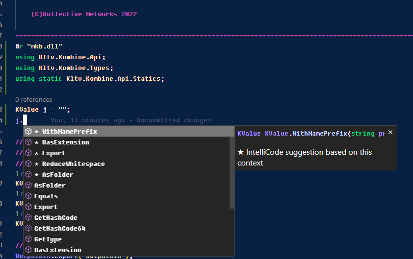
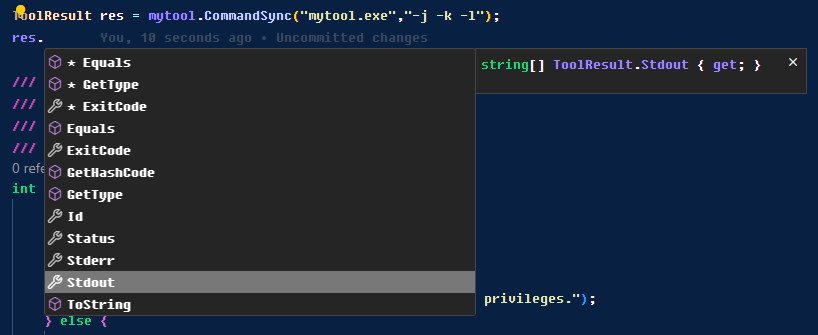

# Kombine Build System

<table>
  <tr>
    <td><a href="https://github.com/kollective-networks/kltv.kombine/releases/latest"></a></td>
  </tr>
</table>

Kombine is a plain and simple cross-platform build system where the build scripts are
written in C#. One single self-contained executable, no dependencies, no new language
to learn.

- [Overview](#overview)
- [Features](#features), and the [state of each feature](doc/features.md)
- [Download and Installation](#download-and-installation)
- [Usage](#usage)
- [Script structure and execution](#script-structure-and-execution)
  - [Enable intellisense in your editor](#enable-intellisense-in-your-editor)
  - [Debugging your scripts](#debugging-your-scripts), and the [debugging guide](doc/debug.md)
- [Executing child scripts and sharing values](#executing-child-scripts-and-sharing-values)
  - [Using Import/Export](#using-importexport)
  - [Using the Shared API](#using-the-shared-api)
  - [Using the Registry API](#using-the-registry-api)
- [The simplest example: execute a tool and fetch the results](#the-simplest-example-execute-a-tool-and-fetch-the-results)
- [Extending Kombine](#extending-kombine), and the [extensions documentation](doc/extensions.md)
- [Examples](#examples)
- [Documentation](#documentation)
  - [API reference](doc/api.md): the types, functions and classes available in scripts
  - [Extensions](doc/extensions.md): [clang](doc/extensions/clang.md), [clang docs](doc/extensions/clang.doc.md), [git](doc/extensions/git.md), [github](doc/extensions/github.md), [bin2cpp](doc/extensions/bin2cpp.md), [bin2obj](doc/extensions/bin2obj.md), [modder](doc/extensions/modder.md), [dotnet docs](doc/extensions/dotnet.doc.md), [env.win.msvc](doc/extensions/env.win.msvc.md)
  - [Debugging guide](doc/debug.md)
  - [How Kombine runs a script](doc/execution.md): reference resolution, compilation, the cache and execution
  - [Building the tool](doc/building.md), with the build, test and publish actions
  - [Feature state](doc/features.md), [reasons](doc/reasons.md), [changelog](changelog.md), [TODO list](doc/todo.md), [third-party licenses](doc/licenses.md)
- [License](#license)

## Overview

There are a ton of different build systems out there, but we had some specific
requirements that none of them fit. Don't get us wrong — the real problem is that we
wanted some bits from each tool. If you want to have fun, just read
[this](https://www.reddit.com/r/cpp/comments/i7825h/build_system_whats_your_favorite/).

For the complete list of requirements and the underlying reasons to create a new build
tool, [check this](doc/reasons.md).

Kombine is based on the [Roslyn Compiler](https://github.com/dotnet/roslyn) and created
in C#, so the language you use to write the build scripts is C#: easy syntax,
self-explanatory and portable across platforms. The tool is a single self-contained
file, so you don't need Dotnet to execute it — Kombine loads and executes your build
scripts without any other requirement.

You don't know C#? Don't be afraid: we kept it as simple as possible, so you don't need
to be a C# master to write a script. Check [Usage](#usage) to start digging into the
build scripts.

## Features

- Works on Windows, Linux and Mac OSX.
- Implements an easy way to pass and receive parameters in your build scripts.
- Launches any tool; commands can be queued and launched in parallel.
- Gives you the complete tool result: exit code and the entire stdout / stderr.
- Being C#, you can use all the string manipulation facilities, regular expressions or
  anything else required to parse text files and results.
- Functions to deal with folders cross-platform (create / delete / copy / move).
- Functions to deal with files cross-platform (exists, read, write, copy, delete).
- Two built-in types (`KValue` / `KList`) for values and lists of values, giving you a
  simpler syntax to maintain, for example, the list of arguments for a tool.
- Consistent information about the host environment, so you don't need custom code per
  platform just to know if you're running as root.
- HTTP download facility, avoiding a third-party tool that differs per host OS.
- Console output with colors for warnings and errors, indentation and even an
  integrated progress bar.
- Zip/tar compression and decompression, JSON and YAML reading.
- Shares your variables with child process environments and child scripts.
- Shares your objects (for example, an opened file) with child scripts.
- A build-wide registry for values that should be consulted by the rest of the scripts.
- File globbing facilities, so you don't need to list every single file in your build.
- Launches child scripts without creating another process.

The current state of each feature is tracked in [doc/features.md](doc/features.md).

## Download and Installation

All the files are in the
[releases](https://github.com/kollective-networks/kltv.kombine/releases) page.

Just grab the file for your platform —
[Windows](https://github.com/kollective-networks/kltv.kombine/releases/latest/download/kombine.win.zip),
[Linux](https://github.com/kollective-networks/kltv.kombine/releases/latest/download/kombine.lnx.tar.gz) or
[Mac OSX](https://github.com/kollective-networks/kltv.kombine/releases/latest/download/kombine.osx.tar.gz)
— and place it on the path. Nothing else.

That's all. No other dependencies. No other languages. You're done. That's the way we
[wanted it](doc/reasons.md).

If you plan to use intellisense to edit your scripts, you may need the reference
assembly as input for your editor. You can take it from
[here](https://github.com/kollective-networks/kltv.kombine/releases/latest/download/kombine.ref.zip);
refer to your IDE documentation about how to activate and use intellisense for C#.

If you plan to debug your build scripts (yes, they can be debugged) you need a Dotnet
debugger. The single-file executable can be debugged by attaching to it (the `-ksdbgw`
flag makes this easy); for the launch (F5) workflow the Dotnet debuggers have problems
with single-file executables, so we provide unpacked versions as well:
[Windows](https://github.com/kollective-networks/kltv.kombine/releases/latest/download/kombine.debug.win.zip),
[Linux](https://github.com/kollective-networks/kltv.kombine/releases/latest/download/kombine.debug.lnx.tar.gz) and
[Mac OSX](https://github.com/kollective-networks/kltv.kombine/releases/latest/download/kombine.debug.osx.tar.gz).
See [Debugging your scripts](#debugging-your-scripts) and the complete
[debugging guide](doc/debug.md).

Take a look at the "examples.debug" project as an example of how to debug inside Visual
Studio (it is a makefile project that launches the Kombine tool to execute the example
scripts with the managed debugger attached).

## Usage

The usage is pretty simple ("mkb" stands for Make Kombine Build):

```text
mkb [parameters] [action] [action parameters]
```

The tool is case sensitive. This is the output if you just execute `mkb`:

```text
Kombine Build Engine <version>
Copyright (C) Kollective Networks 2026. All rights reserved.

mkb [parameters] [action] [action parameters]

    [parameters] They are optional and can be any of the following:

    -ksdbg
       Script will include debug information so script debugging will be possible.
    -ksdbgw
       As -ksdbg but the tool waits for a debugger to attach before executing the action.
    -ksrb or -ksrebuild
       Script will be rebuilt even if it is cached.
    -ko:silent or -ko:s
       Script output will be silent.
    -ko:normal or -ko:n
       Script output will be normal.
    -ko:verbose or -ko:v
       Script output will be verbose.
    -ko:debug or -ko:d
       Script output will be debug.
    -kfile:filename
       Indicates which script file we should execute (default kombine.csx)
    -kforward
       Allows the forward search of the subfolders to resolve #load / child script references (disabled by default).
    -kmodules:strict
       Two different copies of one module (a loaded file with #pragma kombine module) in a run fail the script instead of warning.

    [action] Action to be executed. If not specified the default action is "khelp"
             The action is used to specify which function in the script should be called after evaluation but
             there are some reserved actions for the tool itself which cannot be used for the scripts:

     kversion: Shows tool version and exit.
     khelp: Show this help and exit. Also available as "-h" or "--help" when used alone.
     kconfig: Manages the tool configuration.
     kcache: Manages the tool cache.
     kenv: Shows the environment the tools receive. "kenv tool..." shows where each tool resolves on the path.

    [action parameters]
             They are optional and belong to the specified action. In case of scripts, they are passed to the
             executed function as parameters. For example: mkb kcache help
```

The parameters are intended for the tool itself: whether the script includes debug
information (required to debug it), the output level, which script file to execute
(the default is `kombine.csx` in your current folder), and whether the forward search
of the subfolders is allowed when resolving `#load` and child scripts (disabled by
default, see [Extending Kombine](#extending-kombine)).

> [!IMPORTANT]
> **The output level is for Kombine, not for your script.** Normal shows the messages
> your script prints and nothing else. Verbose and Debug add the internal messages of
> Kombine: what the engine and its API are doing, such as the files a `Glob` matched, why
> a script was rebuilt or where a download was redirected. They exist to diagnose Kombine
> itself.
>
> Your script owns its output. The API reports a failure to your script through its
> return value (`false`, an exit code, `Http.LastReturnCode`) together with the reason
> in the `LastError` of the facility (see [Error reporting](doc/api.md#error-reporting)),
> and prints nothing at normal level, so your script decides what to show and prints it
> with `Msg`. To debug
> your script, attach a debugger (see [Debugging your scripts](#debugging-your-scripts))
> or print your own messages; do not rely on the verbose level for that.

- **Normal** outputs only the messages from your script.
- **Verbose** adds the messages of the Kombine API functions you call.
- **Debug** adds the messages of the Kombine engine itself.

The action is the function that will be executed in your script — see
[Script structure](#script-structure-and-execution). The reserved actions are prefixed
with "k" precisely to avoid conflicts with your own action names, so, for example, the
name `config` is free for you to use.

Everything after the action is considered an action parameter and is passed to the
executed function.

### Exit codes

The exit code of `mkb` follows a fixed contract, so scripts can be driven from other
tools and from CI:

| Exit code | When |
| --- | --- |
| `0` | The action completed and returned 0. Running without an action shows the help and returns 0 as well. |
| `n` | The action returned `n`: the return value of the action is the exit code of the process, so an action returning 7 exits with 7. |
| `1` | The tool detected a failure: the script does not compile, the action threw an exception or aborted with `Msg.PrintAndAbort`, the action was not found or does not return an `int`, the script file is missing, or a reserved action failed (`kconfig` is not implemented, `kcache` without a subcommand or with an unknown one). |
| `130` | The execution was cancelled with Ctrl+C. The running tools are killed first. |

Child scripts follow the same contract: `Kombine()` returns the exit code of the child
and aborts the calling script when it is not zero, unless `exitonerror` is false. The
[exit code example](examples/00.base/mkb.exitcodes.csx) verifies every case.

## Script structure and execution

A script has two different parts: the global code and the actions. One example:

```csharp
KValue mymessage = "hello world!";

int build(string[] args){
	Msg.Print("I'm building: "+mymessage);
	return 0;
}
int clean(string[] args){
	Msg.Print("I'm cleaning: "+mymessage);
	return 0;
}
```

The first part is the global code. It is always executed. You can place there whatever
you want: define values, lists or call functions. For example, if you add a
`Http.DownloadFile("youruri","pathtosave");` line in the global code, the file will be
downloaded on every script execution.

The second part — the functions — are the actions. If you call this script as
`mkb build`, the global code is executed first and then the `build` function. The
function receives the action parameters in the string array, and its return value is
the exit code of the script execution.

Quite easy, right? We tried to fetch the simplicity from make while being cross-platform
out of the box. From an action function you can do whatever you want (create instances,
call other functions... remember, it is C#).

But wait, this should be slow, right? Only the first time: compiling the script with
Roslyn takes a couple of seconds. The compiled script is kept in a cache and the next
executions run it as an application, so they are fast. The cache goes by content:
touching or moving a script changes nothing, and editing one compiles that script only.
The extensions are modules, compiled once per run and shared by every script that loads
them, so a project with many scripts pays for an extension once.

If you want to rebuild your script, use a parameter or an action:

- `mkb kcache clear` deletes everything in the build cache, so the next executions
  rebuild the scripts again.
- `mkb -ksrb youraction yourargs` ignores the cache for the current script, so it is
  rebuilt.

Where the cache lives, what a cached build records and what is compiled again when is
explained in [How Kombine runs a script](doc/execution.md), together with how references
are resolved and how child scripts run.

We also tried to make the syntax as simple as possible. For example, to define a list:

```csharp
KList   src = "my item1";
        src += "my item2";
```

or

```csharp
KList   src = new() { "item1", "item2" };
```

And you can remove items as well:

```csharp
KList   src = new() { "item1", "item2" };
        src -= "item2";
```

This is particularly useful when you deal with command line parameters and you need to
add or remove them. The `KValue` and `KList` types have nice conversions and useful
methods — for example, `KList.Flatten()` converts the list into a single `KValue`, very
handy to pass a list of parameters to a tool.

Don't forget to check the [API reference](doc/api.md) and the [examples](#examples) to
learn what is available.

### Enable intellisense in your editor

If your environment supports some form of intellisense (like Visual Studio Code), the
most standard way is the following — but bear in mind it depends on your environment;
maybe you need to place the reference assembly in a specific location. Refer to your
environment documentation for intellisense options.

The regular way is to add in your script a `#r "mkb.dll"` directive pointing to the
reference assembly of the tool. Grab the reference assembly from
[here](https://github.com/kollective-networks/kltv.kombine/releases/latest/download/kombine.ref.zip)
and put it alongside your script. Optionally add the usings required for the
intellisense to work:

```csharp
#r "mkb.dll"
using Kltv.Kombine.Api;
using Kltv.Kombine.Types;
using static Kltv.Kombine.Api.Statics;
using static Kltv.Kombine.Api.Tool;
```



Remember: this is not required to execute the script — Kombine ignores that code. It
only enables the intellisense to help you write the scripts.

There are no more rules. The rest is up to you. No constraints.
Check the [API provided by the tool](doc/api.md) for the built-in functionality.

### Debugging your scripts

It is possible to debug your scripts with Visual Studio or VSCode and the dotnet
debugger — breakpoints, stepping, watches, everything. The complete guide, covering
both IDEs, is in [doc/debug.md](doc/debug.md). Never forget to pass the `-ksdbg` flag
to generate debug information for the script :)

The quickest method — and the one that works with the **single-file** executable — is
attaching. Run the tool with the `-ksdbgw` flag (it implies `-ksdbg`): it prints its
process id and waits for a debugger before executing the action:

```text
$ mkb -ksdbgw build
Waiting for a debugger to attach. PID: 38760 (Ctrl+C to abort)
```

Then attach from your IDE (in Visual Studio: *Debug → Attach to Process*, choosing the
**Managed (.NET Core, .NET 5+)** engine explicitly with *Select...*; in VSCode: a
`coreclr` attach configuration) and the execution resumes with your breakpoints armed.

In any case, if you use the non-single-file (unpacked) debug build, no attaching is
needed at all: plain launch (F5) debugging works fine with just `-ksdbg`. Attaching and
`-ksdbgw` are only required when debugging with the single-file executable. One example
of `launch.json` for Visual Studio Code launching the unpacked build:

```json
{
	"version": "0.2.0",
	"configurations": [
		{
			"name": "C#: Debug script",
			"type": "coreclr",
			"request": "launch",
			"windows": {
				"program": "mkb.exe"
			},
			"linux":{
				"program": "mkb.out"
			},
			"osx": {
				"program": "mkb.out"
			},
			"args": [ "-ksdbg","-ko:d", "youractionhere","yourparameters" ],
			"cwd": "folder for your script",
			"console": "integratedTerminal",
		}
	]
}
```

As a side note: the dotnet debuggers
[fail to launch](https://github.com/dotnet/runtime/issues/42927) single-file dotnet
binaries — the engine auto-detection does not recognize the bundle as managed
(typically the `0x80131c3c` error,
[still reported on recent .NET versions](https://learn.microsoft.com/en-gb/answers/questions/1867578/how-to-fix-failed-to-attach-to-process-unknown-err)).
The [tracking issue](https://github.com/dotnet/runtime/issues/84428) was closed with
the guidance that **attaching** with the managed engine explicitly selected works
(which is what `-ksdbgw` is for), and the
[breakpoint fix](https://github.com/dotnet/runtime/pull/84965) shipped in .NET 8 — but
the launch path remains unreliable on any .NET version. So, to use F5-style launch
debugging, grab the self-contained but **not** single-file build of the tool and use
it for debugging:

- [Windows](https://github.com/kollective-networks/kltv.kombine/releases/latest/download/kombine.debug.win.zip)
- [Linux](https://github.com/kollective-networks/kltv.kombine/releases/latest/download/kombine.debug.lnx.tar.gz)
- [Mac OSX](https://github.com/kollective-networks/kltv.kombine/releases/latest/download/kombine.debug.osx.tar.gz)

## Executing child scripts and sharing values

Kombine has a function called `Kombine` with the following prototype:

```csharp
int Kombine(string script, string action, string[]? args = null, bool exitonerror = true, bool changedir = true, bool search = true)
```

It invokes another Kombine script. The script string is the filename and may contain an
absolute or relative path. You also specify the action and, optionally, arguments for
it. The `changedir` parameter switches the current working directory to the script
directory while it runs, and `exitonerror` automatically aborts if the child script
returns an error (anything non-zero).

The `search` parameter enables automatic search for the script, in the same order used
when including another script (see [Extending Kombine](#extending-kombine)):

1. The current script directory
2. The current working directory
3. Backward paths (parent directories up to the root)
4. The Kombine tool directory
5. Forward paths (subfolders), only when enabled with `-kforward` or `Engine.ForwardSearch`

The function returns the exit code of the child script execution. Quite simple, right?

If the child could not run at all (script not found, unresolved references, compile error,
missing action) the exit code is 1 and `Engine.LastError` holds the reason. Kombine prints
nothing in that case: the message is yours (see [Engine settings](doc/api.md#engine-settings-engine)).

But maybe you need to share information between your parent and child scripts (some
global definitions, paths, whatever). There are multiple methods:

### Using Import/Export

The first method is using the `KValue` methods `Import` and `Export`. `Export` takes
the content of the variable and sets it in the internal environment table under the
given name:

```csharp
KValue myvar = "value";
myvar.Export("VAR");
```

The content of `myvar` — that is, `"value"` — will be available to:

- Child scripts, if they use the `Import` method.
- Child processes launched by `Exec` or `Tool`, if they read the environment variable
  `VAR`.

So it can also be used to set up environment variables for all the child processes.

`Import` does the opposite, with a twist:

```csharp
KValue myvar = KValue.Import("VAR","othervalue");
```

`myvar` is filled with the value of the environment variable `VAR`, or with
`"othervalue"` as the default if the variable does not exist. This is especially useful
for scripts that may run standalone but accept parameters from parent scripts to modify
their behavior.

### Using the Shared API

Sometimes sharing a value is not enough and you want to share something more complex.
Think of a real-life case: the `compile_commands.json` for clang intellisense. Ideally
your master script defines where the compile commands are stored, and then executes the
different parts of your build, each one adding its own entries to that same file.

For that purpose you have `Share.Set` and `Share.Get` to store and retrieve objects.
`Share.Set` takes a name and the object; `Share.Get` takes the name to retrieve. This
approach is used by the provided [clang.csx](doc/extensions/clang.md) extension to
share the compile commands database with all the descendant scripts:

```csharp
if (Share.Get("compile_commands") != null) {
	compdb = Share.Get("compile_commands") as JsonFile;
	return true;
} else {
	// Create it if it does not exist
	compdb = new JsonFile(file);
	if (compdb.Doc == null) {
		// It is a new one, just create the array.
		compdb.Doc = new JsonArray();
		if (compdb.Save() == true){
			Share.Set("compile_commands",compdb);
			return true;
		}
		Msg.PrintWarning("Failed to create a new compile commands file: "+file,Msg.LogLevels.Verbose);
		return false;
	}
	Share.Set("compile_commands",compdb);
	return true;
}
```

Remember: the Shared API exports to child scripts, not to parents or siblings — exactly
the same as Import/Export.

A side note: since you may share a complex object defined as a class in your script,
that definition is only in the scope of your script — you share the object but not the
definition. You can include the same definition in your child scripts and cast the
retrieved object with `static T? Cast<T>(object? myobj)`, which copies the properties
present in both types by name. The clang.csx extension shares its default options the
same way between script instances (it copies the properties by name itself, converting
the enumerations declared in the extension by their number, which a plain cast would skip):

```csharp
object? obj = Share.Get("ClangOptions");
if (obj != null) {
	ClangOptions? opt = Cast<ClangOptions>(obj);
}
```

### Using the Registry API

Sometimes you need to propagate values in a different direction. So far we can share
things with child scripts and the tool environment, but consider the following real
case:

You have a project with 20 different libraries that build independently; maybe 5 of
them take another 5 as input, so you need to add the include directories, the library
folders, and so on. Now 2 libraries change their paths because you reorganized — and
you have to walk through all your scripts fixing the artifact paths. Quite common,
right?

The registry helps with that. It is a build-wide dictionary for **all** the scripts, no
matter their relationship. When a library is built, it can register the routes for the
rest of the components that may want to consume it. If you change your outputs, the
consuming scripts read from the registry and you only touch the affected library.

For example, in the build step of your library:

```csharp
Share.Register("mylibrary","includes",RealPath("includes/"));
```

And in another script that requires the library:

```csharp
KValue regvalue = Share.Registry("mylibrary","includes");
```

It can also be used to register dependencies resolved per platform in the first steps
of the build. This way you don't need to touch a ton of scripts every time a dependency
is modified — just the place where it is registered.

## The simplest example: execute a tool and fetch the results

We have a good shortcut to execute anything:

```csharp
int Result = Exec("/path/toMyTool/mytool.exe","arg1 arg2",true);
```

One of the prototypes is `int Exec(string command, string? args = null, bool showoutput = false)`,
and remember you can pass `KValue` / `KList` as well:

```csharp
KValue toolname = "mytool.exe";
if (Host.IsMacOS())
	toolname = "mytool.out";
KList args = new() { "arg1","arg2" };
int Result = Exec(toolname,args);
```

But maybe that is not enough, since it only fetches the exit code. Nice for simple
commands, but not so powerful. If you need more, use the `Tool` class:

```csharp
Tool mytool = new Tool("mytool");
ToolResult res = mytool.CommandSync("mytool.exe","-j -k -l");
```



In `ToolResult` you have whatever you need, including stdout / stderr and the exit
code. Here we launched the command synchronously (execute and block until it finishes),
but the `Tool` class can also queue commands and launch them in parallel, imposing a
limit on the number of concurrent executions. The launched tool receives a copy of the
current environment variables, so if you exported something, it will receive it.

Check the [API reference](doc/api.md) for more details about console output, shell
execution and more.

## Extending Kombine

Kombine has a [built-in API](doc/api.md) for the common cases, but you may want to
extend it in a reusable way. A common use case is encapsulating a tool execution —
to simplify building the command line, add default arguments, etc.

Being C# you can, of course, create a class to encapsulate any functionality. To keep
your code organized and reuse those extensions between projects, we overloaded the load
directive to allow nicer things.

In C# scripting there is a `#load "whatever"` directive to include another script in
the current one. `#load` and `#r` directives must be placed before any regular
statement (comments don't count). In regular C# scripting the directive only accepts
relative or absolute paths, which forces you to maintain the script relationship in
your file system. In Kombine, `#load` works a bit differently:

- If the path is absolute, it is used as is.
- If the path is an URI, the file is fetched from that URL the first time (and again
  with `-ksrb`), stored in the cache and used from there in the following runs.
- If the path is relative, Kombine looks in several folders, in this order:
  1. The folder of the script that contains the `#load`
  2. The script directory (where the running script is located)
  3. The current working directory
  4. Back-trace directories (parent directories up to the drive root)
  5. The tool directory (where the tool is located)
  6. The subfolders (forward search), only when enabled with `-kforward` or
     `Engine.ForwardSearch`. It is disabled by default since it could bind a foreign
     copy of a helper when repositories are nested.

This way you can keep a folder in your project structure with your scripts and load
them from any point — `#load "myscriptfolder/myscript.csx"` finds the folder by
backtracing, no matter where you are. You can also keep your own repository of scripts
and load them by HTTP. Nice, right?

A set of ready-made extensions (clang, git, github and more) is provided in the
[extensions](extensions/) folder and documented in [doc/extensions.md](doc/extensions.md).

## Examples

In the [examples](examples/) folder you can find several examples to check out how this
thing works. There is a [kombine.csx](examples/kombine.csx) in that folder which can
execute all the examples at once: from the `examples` folder, run `mkb all`, or one group
with `mkb test` (the engine examples), `mkb extensions` (the extension examples) or
`mkb extras` (the real world builds). Every example prints a report with one aligned line
per check and a summary, and fails the run when a check fails.

| Example | Demonstrates |
| --- | --- |
| [00.base](examples/00.base/) | Version checks, admin rights, the exit code contract, progress reporting, the log handler and the modules. |
| [01.simple](examples/01.simple/) | Minimal script with two actions. |
| [02.types](examples/02.types/) | Operations with `KValue` and `KList`. |
| [03.child](examples/03.child/) | Child scripts, Import/Export and the other sharing methods. |
| [04.folders](examples/04.folders/) | Files, folders and compression (zip, tar.gz, tar.bz2, tar.xz). |
| [05.network](examples/05.network/) | Fetching files from HTTP sources; loading extensions by URL. |
| [06.extensions](examples/06.extensions/) | The provided extensions: clang (a grouped test of every verb, the output modes and the up to date checks, plus lib, dll and exe sub projects), clang docs, git, bin2cpp, bin2obj. |
| [07.extras](examples/07.extras/) | Real-world builds: sdl2 (cloned with git), msys2 package fetching. |

Since the spirit of Kombine is to reuse as much as possible, the reusable build scripts
are provided in the [extensions](extensions/) folder — see
[doc/extensions.md](doc/extensions.md) for the complete list and their documentation.

If you create an extension you think could be useful for others, please share it.
Everything is welcome.

## Documentation

- [API reference](doc/api.md) — the script API: types, functions and classes.
- [Extensions](doc/extensions.md) — the provided extensions and how to use them.
- [Debugging guide](doc/debug.md) — how to debug scripts in Visual Studio and VSCode.
- [Feature state](doc/features.md) — current state of each feature.
- [Reasons](doc/reasons.md) — requirements and why Kombine was created.
- [How Kombine runs a script](doc/execution.md) — how a script is found, compiled, cached and run.
- [Building the tool](doc/building.md) — how to build Kombine itself.
- [Changelog](changelog.md) — version history.
- [TODO list](doc/todo.md) — what is pending.
- [Third-party licenses](doc/licenses.md) — licenses of the used dependencies.

## License

Kombine is released under the [MIT License](license.md).

Copyright (c) 2022 Kollective Networks
